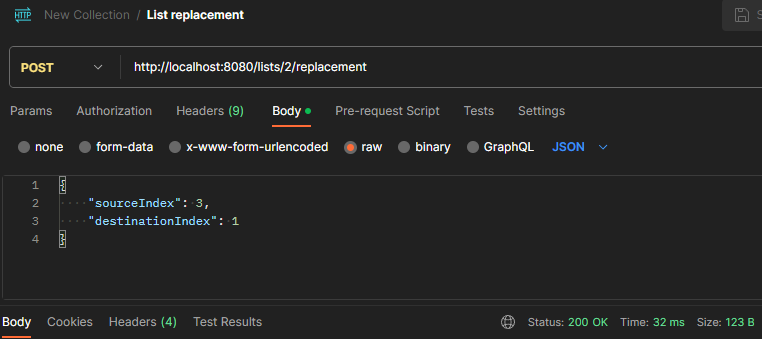
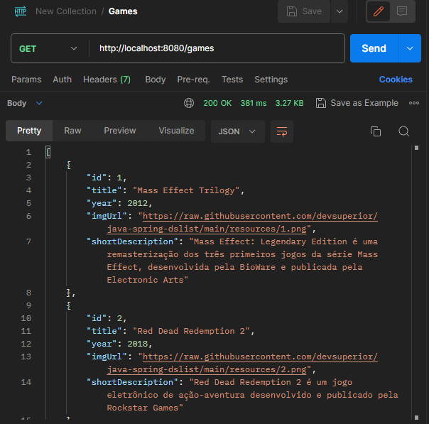

## Screenshots

## Sobre o Projeto:

Projeto de uma API que lista itens e que pode ser acessada e manipulada através de seus endpoints.

## 💻 Tecnologias utilizadas:

- Java (Maven)
- Spring Boot (Spring Initializr)
- H2 (BD test) / PostgreSQL (BD homolog)
- Postman
- Git/Github

## 📱 Endpoints:

- `GET /games`: Requisita uma versão resumida de todos os itens da tabela "Games".
- `GET /games/id`: Pega todas as informações do item de `id` correspondente.
- `GET /lists`: Requisita as informações das listas (coleção) de itens.
- `GET /listId/games`: Requisita os itens que estão dentro da `List` de `id` correspondente.
- `POST /listId/replacement`: Move a posição de um item dentro da `List` de `id` correspondente (Requer Body).